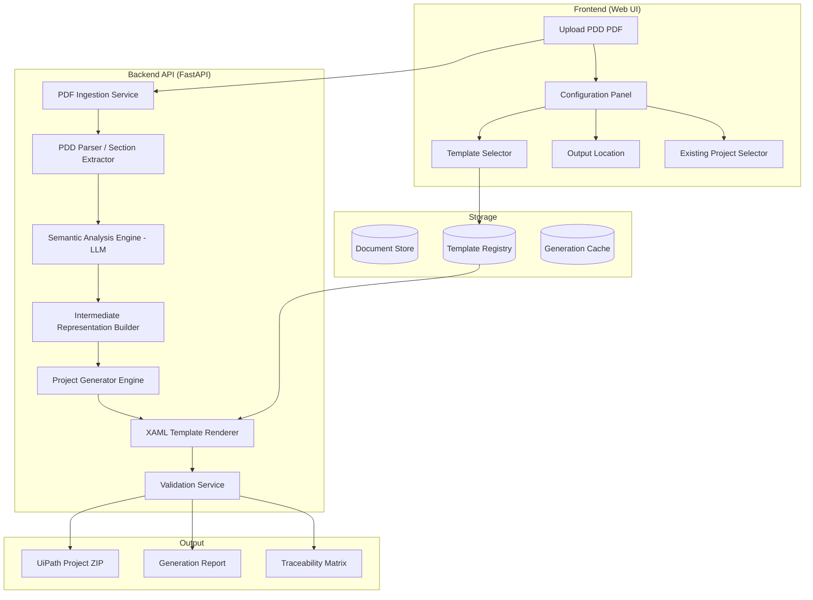
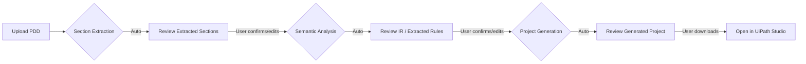

# PDD-to-UiPath Project Generator — Product & Engineering Plan

## 1. Product Definition

**Product Name (working):** PDD Forge

**One-liner:** A system that ingests a PDF-based Process Design Document and produces a structurally valid, template-aware UiPath project scaffold — including XAML workflows, configuration files, and connected components.

**Product Type:** Developer tooling / code-generation platform for RPA engineers.

**Core Value Proposition:** Reduce the manual translation effort between a signed-off PDD and the first runnable UiPath project from days to minutes, while preserving traceability between document sections and generated artifacts.

**Key Assumptions:**
1. The input PDD follows a broadly standard structure (see §7 for variance handling).
2. The target output is a *scaffold* — not a production-ready, deployed automation. Human review is mandatory.
3. UiPath Studio (Windows or cross-platform) is the target IDE; generated projects must open cleanly in Studio 2023.10+.
4. The system does **not** replace the Solution Architect or the RPA Developer — it accelerates them.

---

## 2. Problem and Target Outcome

### Problem

| Pain Point | Impact |
|---|---|
| PDD-to-project translation is manual, repetitive, and error-prone | 2–5 days of scaffolding per process |
| Business rules in PDDs are often ambiguous; developers re-interpret them inconsistently | Quality variance across developers |
| REFramework and other templates require boilerplate that is identical across projects | Wasted senior developer time |
| No traceability link between PDD sections and generated XAML files | Audit and compliance gaps |

### Target Outcome

| Outcome | Measurable Target |
|---|---|
| Scaffolding time reduction | ≥ 70% reduction vs. manual |
| Structural compliance | 100% of generated projects open in UiPath Studio without errors |
| Coverage | ≥ 80% of PDD sections mapped to at least one generated artifact |
| Developer adoption friction | < 15 minutes from upload to generated project |

---

## 3. Feasibility Analysis

### 3.1 Verdict: **Conditionally Feasible as Semi-Automation**

Full end-to-end automation (PDD in → production robot out) is **not feasible** with current technology. Semi-automation (PDD in → reviewed scaffold out) **is feasible** and valuable.

### 3.2 Feasibility Breakdown

| Capability | Feasibility | Confidence | Notes |
|---|---|---|---|
| PDF text extraction | ✅ High | 95% | Mature libraries (PyMuPDF, pdfplumber, Docling). Tables and flowcharts require layout-aware parsing. |
| Semantic section identification | ✅ High | 85% | LLMs (GPT-4o, Claude 3.5+) reliably identify PDD sections with few-shot prompting. |
| Business rule extraction | ⚠️ Medium | 65% | LLMs can extract explicit rules. Implicit rules, cross-references, and domain jargon require human validation. |
| Process flow reconstruction | ⚠️ Medium | 60% | Sequential steps → Sequence XAML is reliable. Complex branching and parallel paths require review. |
| XAML generation (valid) | ✅ High | 90% | XAML is XML; template-based generation with string interpolation is reliable. Do NOT use LLM to generate raw XAML. |
| Activity mapping (step → UiPath activity) | ⚠️ Medium | 55% | Common patterns (Open Browser, Type Into, Click) map well. Custom activities, selectors, and edge cases do not. |
| REFramework integration | ✅ High | 90% | Template structure is fixed and well-documented. Config.xlsx generation is straightforward. |
| Selector generation | ❌ Low | 15% | Selectors require live application access. Cannot be generated from PDD text alone. |
| Orchestrator integration | ⚠️ Medium | 70% | Queue names, asset names, and folder structure can be extracted. Actual provisioning requires API access. |

### 3.3 Automation Boundary Matrix

| Layer | Automatable | Semi-Automatable | Manual |
|---|---|---|---|
| Project structure | `project.json`, folder layout, `nuget.config` | Dependency selection | Custom library references |
| Workflow files | Skeleton XAML with Invoke calls, state machine structure | Activity parameters, variable types | Selectors, dynamic expressions |
| Configuration | `Config.xlsx` with extracted settings/constants/assets | Value validation | Environment-specific values |
| Exception handling | Try-Catch wrappers, BRE vs. SysEx classification stubs | Retry logic parameters | Recovery workflow logic |
| Business logic | Placeholder `Process.xaml` with TODO comments and extracted rules | Decision tree scaffolds | Complex conditional logic |
| Documentation | In-workflow annotations from PDD text | Cross-reference validation | — |

---

## 4. Risks and Constraints

### 4.1 Technical Risks

| Risk | Severity | Likelihood | Mitigation |
|---|---|---|---|
| PDD format variance across organizations | High | Very High | Implement adaptive parsing with LLM + fallback to manual section tagging UI |
| LLM hallucination in rule extraction | High | High | Mandatory human review step; confidence scoring; never auto-deploy |
| Generated XAML fails to open in Studio | Critical | Medium | Maintain a XAML validation test suite; use template-based generation, not LLM-generated XAML |
| Token limit exceeded for large PDDs | Medium | High | Chunking strategy with section-level processing; use models with 128K+ context |
| Flowchart/diagram images in PDD are ignored | Medium | High | MVP: flag and skip; v2: vision model extraction |
| UiPath version incompatibility | High | Medium | Pin to specific Studio version; maintain version-specific XAML templates |

### 4.2 Product Risks

| Risk | Severity | Mitigation |
|---|---|---|
| Users expect production-ready output | High | Explicit UI messaging: "This is a scaffold. Review required." |
| Over-reliance on tool reduces developer skill | Medium | Position as accelerator, not replacement |
| PDD quality is low (garbage in → garbage out) | High | PDD quality scoring with actionable feedback |

### 4.3 Constraints

- **No public XAML schema:** UiPath does not publish an XSD. XAML templates must be reverse-engineered from Studio-generated files and maintained manually.
- **Selector generation is impossible from PDD alone:** The system cannot produce working UI selectors without access to the target application.
- **LLM costs at scale:** Processing a 40-page PDD with GPT-4o costs ~$0.50–$2.00 per run. Must be factored into pricing.

---

## 5. Proposed Architecture

### 5.1 High-Level Architecture



### 5.2 Key Architectural Decisions

| Decision | Choice | Rationale |
|---|---|---|
| XAML generation method | Template-based (Jinja2 / string interpolation) | LLM-generated XAML is unreliable. Templates guarantee structural validity. |
| LLM usage scope | PDD parsing and semantic extraction ONLY | Keep LLM in the "understanding" layer, not the "generation" layer. |
| Intermediate representation | Custom JSON schema (IR) | Decouples PDD understanding from project generation. Enables multiple output formats. |
| Deployment model | Web application (self-hosted or cloud) | Supports team usage; avoids desktop dependency |
| Project output format | ZIP archive of complete project folder | Consistent with UiPath project sharing conventions |

### 5.3 Intermediate Representation (IR) Schema — Core

```json
{
  "process": {
    "name": "string",
    "description": "string",
    "type": "transactional | linear",
    "applications": ["string"],
    "transaction_definition": {
      "source": "queue | datatable | api",
      "item_schema": {}
    }
  },
  "steps": [
    {
      "id": "string",
      "name": "string",
      "description": "string",
      "type": "action | decision | loop | exception",
      "application": "string",
      "inputs": [],
      "outputs": [],
      "business_rules": [],
      "exceptions": [],
      "pdd_reference": "section/page",
      "suggested_activities": []
    }
  ],
  "configuration": {
    "settings": {},
    "constants": {},
    "assets": []
  },
  "exceptions": {
    "business": [],
    "application": []
  }
}
```

---

## 6. Core Modules

### Module 1: PDF Ingestion Service
- **Input:** PDF file (up to 100 pages)
- **Output:** Structured text with layout metadata
- **Tech:** PyMuPDF + pdfplumber for text/tables; optional Docling for complex layouts
- **Responsibilities:** Text extraction, table detection, image flagging, page-section mapping

### Module 2: PDD Section Extractor
- **Input:** Structured text
- **Output:** Labeled sections (scope, steps, rules, exceptions, applications, etc.)
- **Tech:** LLM with few-shot prompting + regex fallbacks for common headers
- **Responsibilities:** Section boundary detection, header classification, content segmentation

### Module 3: Semantic Analysis Engine
- **Input:** Labeled sections
- **Output:** Intermediate Representation (IR)
- **Tech:** LLM (GPT-4o or Claude 3.5 Sonnet) with structured output / tool use
- **Responsibilities:** Business rule extraction, step sequencing, decision point identification, exception classification (BRE vs SysEx), input/output mapping, application identification

### Module 4: IR Validator
- **Input:** IR JSON
- **Output:** Validated IR + quality report
- **Tech:** Pydantic models, custom validation rules
- **Responsibilities:** Schema validation, completeness scoring, ambiguity detection, conflict detection

### Module 5: Project Generator Engine
- **Input:** Validated IR + selected template + output configuration
- **Output:** Complete UiPath project folder
- **Tech:** Jinja2 templates, custom XAML builder
- **Responsibilities:** Template selection, folder structure creation, `project.json` generation, workflow routing

### Module 6: XAML Template Renderer
- **Input:** IR steps + XAML templates
- **Output:** `.xaml` workflow files
- **Tech:** Jinja2 + XML builder (lxml)
- **Responsibilities:** Activity tree construction, variable/argument declaration, Invoke Workflow wiring, annotation injection

### Module 7: Configuration Generator
- **Input:** IR configuration section
- **Output:** `Config.xlsx`, `nuget.config`
- **Tech:** openpyxl
- **Responsibilities:** Settings/Constants/Assets sheet population, dependency declaration

### Module 8: Validation Service
- **Input:** Generated project folder
- **Output:** Validation report
- **Tech:** XML schema validation, custom rules
- **Responsibilities:** XAML well-formedness, `project.json` integrity, file reference consistency, namespace validation

### Module 9: Report Generator
- **Input:** IR + generated project
- **Output:** Generation report (PDF/HTML) + traceability matrix
- **Tech:** Jinja2 HTML templates, WeasyPrint
- **Responsibilities:** PDD-to-artifact mapping, confidence scores per section, TODO/review item list

---

## 7. PDD Parsing Strategy

### 7.1 Challenge

PDDs vary significantly across organizations. There is no universal schema. Common variances:
- Different section ordering and naming
- Tables vs. prose for step descriptions  
- Embedded flowchart images vs. textual flow descriptions
- Varying levels of granularity

### 7.2 Multi-Pass Parsing Pipeline

```
Pass 1: Raw Extraction
  ├── Text extraction (PyMuPDF)
  ├── Table extraction (pdfplumber)
  ├── Image detection and flagging
  └── Page/paragraph boundary detection

Pass 2: Section Classification (LLM)
  ├── Few-shot prompt with 5+ PDD variants
  ├── Output: section labels + boundaries
  ├── Confidence score per section
  └── Fallback: user-assisted section tagging UI

Pass 3: Content Extraction (LLM per section)
  ├── Steps → ordered action list
  ├── Rules → conditional logic structures
  ├── Exceptions → classified exception list
  ├── Applications → application inventory
  └── Config → settings/constants/assets

Pass 4: IR Assembly
  ├── Cross-reference resolution
  ├── Step dependency graph construction
  ├── Conflict detection
  └── Completeness scoring
```

### 7.3 Handling Flowchart Images

| Approach | Phase | Method |
|---|---|---|
| Flag and skip | MVP | Detect images, log warning, ask user to provide textual description |
| Vision model extraction | v2 | GPT-4o vision / Claude vision to describe flowchart steps |
| Structured extraction | v3 | Fine-tuned model to convert flowchart images to IR steps |

### 7.4 PDD Quality Score

Before generation, compute a quality score:

| Dimension | Weight | Criteria |
|---|---|---|
| Section completeness | 30% | Are all expected sections present? |
| Step granularity | 25% | Are steps specific enough to map to activities? |
| Rule explicitness | 20% | Are business rules stated as clear conditions? |
| Exception coverage | 15% | Are exceptions listed with handling procedures? |
| Application specificity | 10% | Are application names and actions identified? |

Score < 50% → warn user, suggest PDD improvements before generation.

---

## 8. Workflow Generation Strategy

### 8.1 XAML Generation Approach

> [!CAUTION]
> **Never use an LLM to generate raw XAML.** UiPath XAML has undocumented internal structures, namespace requirements, and serialization quirks. LLM-generated XAML will fail to open in Studio in most cases.

**Approach: Template Composition**

1. Maintain a library of validated XAML fragment templates (tested in UiPath Studio).
2. Each template corresponds to a common pattern (Sequence, If/Else, Try-Catch, ForEach, Invoke Workflow, etc.).
3. The generator composes these fragments based on the IR, injecting:
   - `DisplayName` from step names
   - Variable declarations from inputs/outputs
   - Annotation text from PDD descriptions
   - `InvokeWorkflowFile` paths for sub-workflows

### 8.2 Fragment Library (Core Set)

| Fragment | Use Case | Parameters |
|---|---|---|
| `sequence.xaml.j2` | Linear step container | DisplayName, Variables, Children |
| `flowchart.xaml.j2` | Decision-heavy flows | DisplayName, Nodes, Connections |
| `if_else.xaml.j2` | Binary decision | Condition (placeholder), Then, Else |
| `try_catch.xaml.j2` | Exception handling wrapper | TryBody, CatchType, CatchBody |
| `invoke_workflow.xaml.j2` | Sub-workflow call | FilePath, Arguments |
| `log_message.xaml.j2` | Logging | Level, Message |
| `assign.xaml.j2` | Variable assignment | Variable, Value |
| `for_each_row.xaml.j2` | DataTable iteration | DataTable, Body |
| `get_queue_item.xaml.j2` | Orchestrator queue read | QueueName, OutputVariable |
| `set_transaction_status.xaml.j2` | Queue status update | Status, ErrorType |

### 8.3 What Gets Generated vs. What Gets Stubbed

| Generated (runnable) | Stubbed (TODO placeholder) |
|---|---|
| Project structure and `project.json` | Selector strings (marked `TODO: Add selector`) |
| `Main.xaml` state machine (REFramework) | Expression values in Assign activities |
| Workflow file hierarchy with Invoke wiring | Custom activity configurations |
| `Config.xlsx` with extracted settings | Environment-specific credential references |
| Try-Catch wrappers per step | Recovery workflow logic |
| Log Message activities with PDD text | Email notification bodies |
| Annotations with PDD section references | — |

---

## 9. Template-Based Generation Strategy

### 9.1 Supported Templates

| Template | Description | When Selected |
|---|---|---|
| **REFramework (Queue)** | State machine with Orchestrator Queue-based transactions | PDD describes transactional process with queue items |
| **REFramework (Tabular)** | State machine with DataTable-based transactions | PDD describes batch processing from file/database |
| **Linear Process** | Simple Sequence-based Main.xaml | PDD describes a non-transactional, sequential process |
| **Attended Trigger** | Form-triggered process with user interaction | PDD describes attended automation with user inputs |
| **Blank (Minimal)** | Only project.json + Main.xaml | User wants maximum control |

### 9.2 Template Registry Structure

```
templates/
├── reframework-queue/
│   ├── manifest.json          # metadata, required IR fields
│   ├── project.json.j2        # project.json template
│   ├── Main.xaml.j2            # state machine template
│   ├── Framework/
│   │   ├── InitAllSettings.xaml.j2
│   │   ├── InitAllApplications.xaml.j2
│   │   ├── GetTransactionData.xaml.j2
│   │   ├── SetTransactionStatus.xaml.j2
│   │   ├── CloseAllApplications.xaml.j2
│   │   └── KillAllProcesses.xaml.j2
│   ├── Process.xaml.j2
│   └── Data/
│       └── Config.xlsx.j2
├── reframework-tabular/
│   └── ...
├── linear/
│   └── ...
└── attended/
    └── ...
```

### 9.3 Template Selection Logic

```
IF IR.process.type == "transactional":
    IF IR.process.transaction_definition.source == "queue":
        → REFramework (Queue)
    ELIF IR.process.transaction_definition.source == "datatable":
        → REFramework (Tabular)
ELIF IR.process.type == "linear":
    IF IR.process.has_user_interaction:
        → Attended Trigger
    ELSE:
        → Linear Process
ELSE:
    → Suggest to user, default to Linear
```

User can always override the auto-suggestion.

---

## 10. Existing Project Injection Strategy

### 10.1 Modes

| Mode | Description | Complexity |
|---|---|---|
| **New Project** | Generate from scratch into empty folder | Low |
| **Empty Project Injection** | User selects an existing empty UiPath project; system populates it | Medium |
| **Partial Merge** | User has a project with some files; system adds missing components | High (v2+) |

### 10.2 Empty Project Injection Flow

```
1. User selects existing project folder (or ZIP)
2. System reads existing project.json
3. Validates: is the project empty or near-empty?
   - Check: only Main.xaml with default content
   - Check: no custom workflows exist
4. If valid:
   a. Preserve existing project.json metadata (name, Studio version, runtime)
   b. Merge generated dependencies into existing dependencies
   c. Write generated XAML files into project folder
   d. Write Config.xlsx if not present
   e. Update project.json entryPoint if needed
5. If not valid (project has existing workflows):
   a. Warn user: "This project is not empty"
   b. Offer: generate into subfolder, or abort
```

### 10.3 Conflict Resolution Rules

| Conflict | Resolution |
|---|---|
| `project.json` exists | Merge dependencies; preserve existing metadata |
| `Main.xaml` exists and is non-default | Skip; warn user |
| `Config.xlsx` exists | Merge sheets; add new rows; do not overwrite existing |
| File name collision | Suffix with `_generated`; warn user |

---

## 11. Human-in-the-Loop Design

### 11.1 Philosophy

> [!IMPORTANT]
> This system is a **co-pilot**, not an auto-pilot. Every generated artifact must be reviewable and overridable before finalization.

### 11.2 Review Points



### 11.3 Review Interfaces

| Review Point | What User Sees | What User Can Do |
|---|---|---|
| **Section Review** | Extracted sections with PDD page references | Re-label sections, merge/split sections, add missing text |
| **IR Review** | Structured view of steps, rules, exceptions | Edit step names, reorder steps, modify rules, add exceptions |
| **Template Selection** | Auto-suggested template with rationale | Override template choice |
| **Generation Preview** | File tree + per-file diff view | Exclude files, edit annotations, regenerate specific files |
| **Quality Report** | Confidence scores, TODOs, warnings | Acknowledge warnings, add notes |

### 11.4 Confidence-Based Gating

| Confidence Level | Behavior |
|---|---|
| ≥ 80% | Auto-proceed; show green indicator |
| 50–79% | Proceed with yellow warning; highlight uncertain items |
| < 50% | Block auto-proceed; require explicit user confirmation |
| N/A (image-based content) | Flag as "unprocessable"; require manual input |
